### This is the Unoffical Tuxedo Blender Plugin which is maintained by the Neoneko team, the people whom also maintain the Unoffical Cats Blender Plugin. Please report issues here.

## Tuxedo Blender Plugin - a Blender plugin to make importing character models into various game engines painless and fast.

[Questions? Join us on Discord!](https://discord.neoneko.xyz)


### Features and How-Tos

<details>
  <summary>Bake a super-performant avatar from just about any starting point!</summary>
  
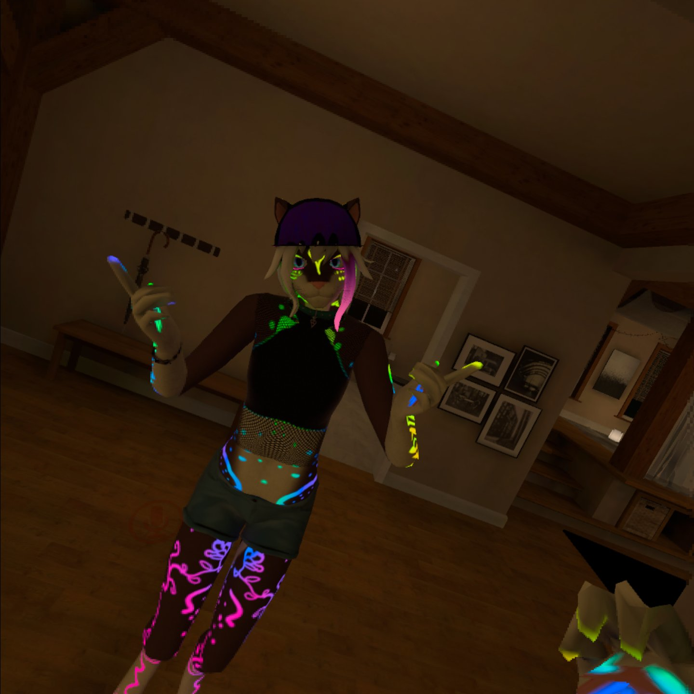
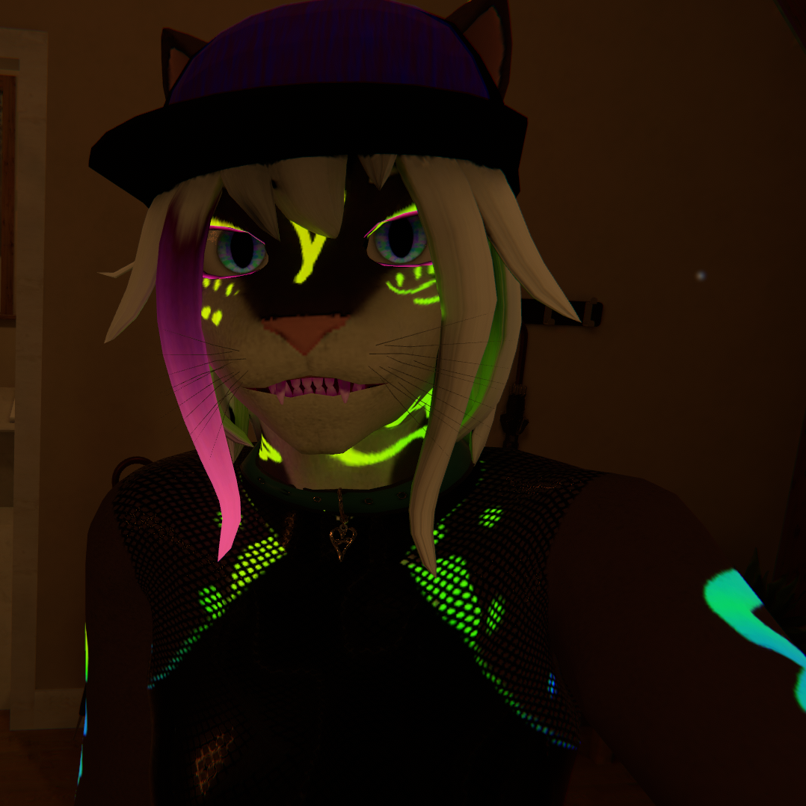

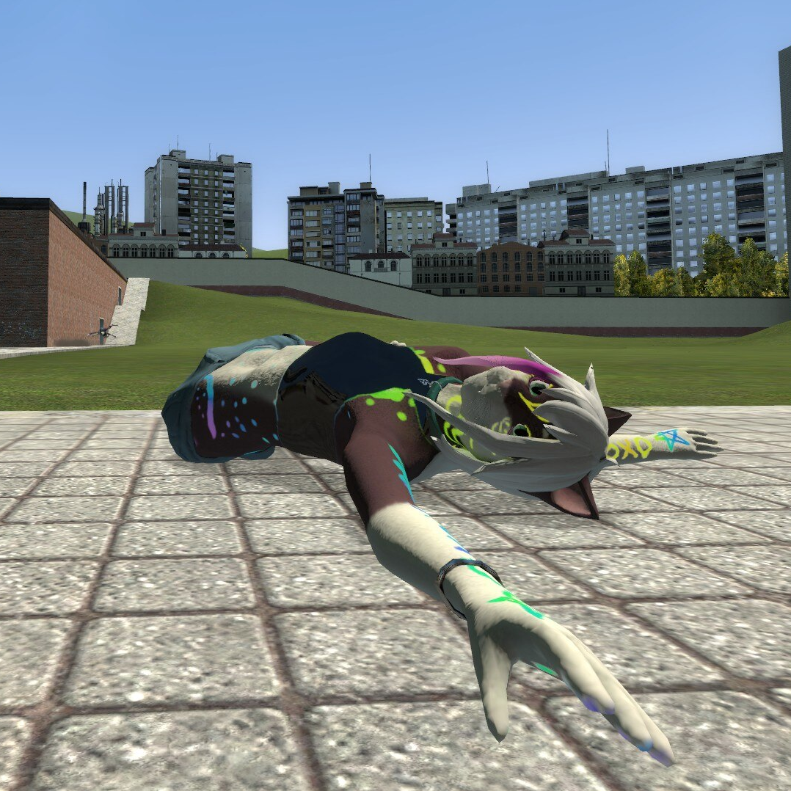
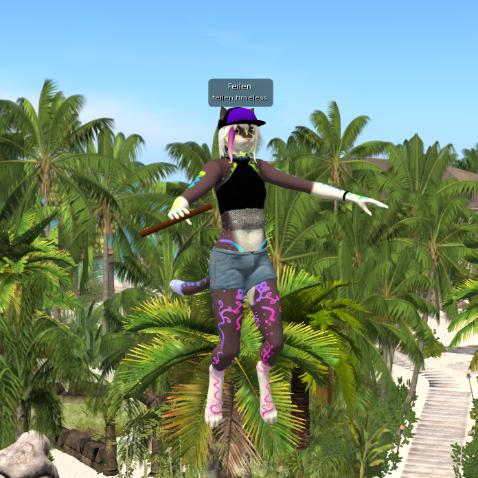

_Up/Left: 'Good' 10000 tri version of model, running on Quest 1. Up/Right: 'Excellent' 32k tri model, running on Desktop.  Ambient occlusion and lighting baked and premultiplied._

_Down/Left: Nearly the same model, but running in Garry's Mod. Down/Right: Same model, but in Second Life._

- **Support every platform at once** - TBP currently supports Unity (Desktop), Unity (Quest - VRChat), Second Life, Garry's Mod (organic setup), and Garry's Mod (metallic setup)
  - All supported platforms (besides Gmod) can be baked to at once, with little added bake time.
- **Material atlassing, but better!** - TBP can bake all of your meshes into one UV space, reducing your material count to 1 (or 2, if optimizing for shapekeys)
  - Optionally enlarges all vertex groups from the Eye bones and all children, so irises are never blurry
  - Uses UVPackmaster where available for extra efficient UVMaps
- **Go beyond optimization** - Bake in ambient occlusion, reflected diffuse light, and reflected emission for an ultra-detailed look!
- **Non-destructive** - Instantly duplicate and decimate any model, without affecting the original
- **Preserves high-detail normals** - Bake the original in Object coordinates, decimate, then rebake to Tangent coordinates, making the copy shade much like the original
- **Automatic detection** - 'Autodetect' buttons for Desktop and Quest, which look through all materials in all meshes in your model and selects which bake passes are relevant to your model (not including Ambient Occlusion)
- **Efficiently packed** - Once passes are determined, organizes the Alpha pack settings to have the most efficient possible configuration
- **Fully PBR** - Bake almost every pass supported by the Standard shader
- **Preserves shapekeys** - Uses the new 'Smart' decimation mode, preserving visemes/blend shapes
- **Full previews** - Creates a new material setup to show you how the new textures are supposed to be plugged into Unity
- **Bone-capable props** - Add props to your VRChat avatar without incurring an extra performance penalty. Props are created by moving the resulting geometry to extra bones which are shrunk out of sight - adding a tiny skinning cost, instead of adding more draw calls.

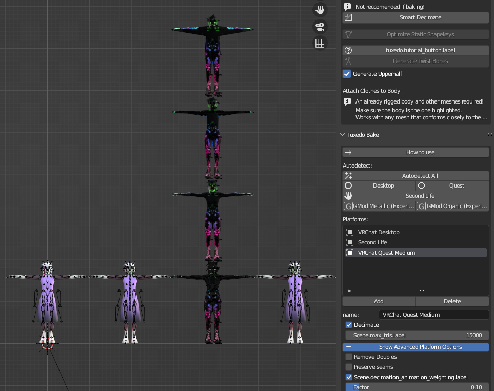

### Quick start:
For most people, all you'll have to do is:

0. Make sure your project is saved as a .blend somewhere.
1. Click the Autodetect button, confirm the resulting platforms make sense for you.
   * Optional: check 'Ambient Occlusion' for more shadow detail, as it's not detected by auto-detect.

   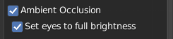

2. Click 'Copy and Bake (SLOW!)', and wait for it to complete (may take a while)

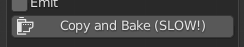

3. Once you've looked over the results, locate the 'Tuxedo Bake' output directory, inside your current project directory.
4. Import the whole folder into your unity project.
   * For Quest, you'll want to make a duplicate of your unity project and click "Switch to Android platform" in the VRC control panel.
   * Reccomended: For each texture, edit the texture settings as shown in [Reccomended Texture Settings](https://github.com/feilen/tuxedo-blender-plugin/README.md#reccomended-texture-settings)
5. Setup your rig as usual (humanoid, map bones) and add to your scene.
6. Copy your existing avatar's properties (and blueprint ID) to the new avatar.
   * [Pumkin's Avatar Tools](https://github.com/rurre/PumkinsAvatarTools) can help you do this quickly.
   * [Nara's Unity Tools](https://github.com/Naraenda/NarasUnityTools) can quickly simplify dynamic bones, by turning some into rotation constraints, and includes an option for fake bone gravity on Quest.
7. Create a new Material (right click folder -> Create -> Material) and select the shader you'll be using.
   * For Desktop, Standard is a good starting point.
   * For Quest, you'll want to select your shader based on what passes you've selected:
   	 * If you're using only a Diffuse map, select `VRChat/Mobile/Diffuse` or `VRChat/Mobile/Toon Lit`
   	 * If you're using only a Diffuse and Normal map, select `VRChat/Mobile/Bumped Diffuse`
   	 * Otherwise, select `VRChat/Mobile/Standard Lite`
   * For Quest, it's reccomended to check [GPU instancing.](https://docs.vrchat.com/docs/quest-content-optimization)
8. Drag and drop each texture to its slot in the material.
   * Albedo: `SCRIPT_questdiffuse.png` if using AO, otherwise `SCRIPT_diffuse.png`
   * Metallic: `SCRIPT_metallic.png`
     * Metallic and Smoothness sliders should be set to 1 when the map used.
   * Normal: `SCRIPT_normal.png`
   * Emission: `SCRIPT_emission.png`
   	 * Make sure to check 'Enable Emission' and set 'Emission Color' to #FFFFFF if you're using this!
9. Drop the new material onto your avatar in the scene, or onto 'Body' in the 'Hierarchy' view.

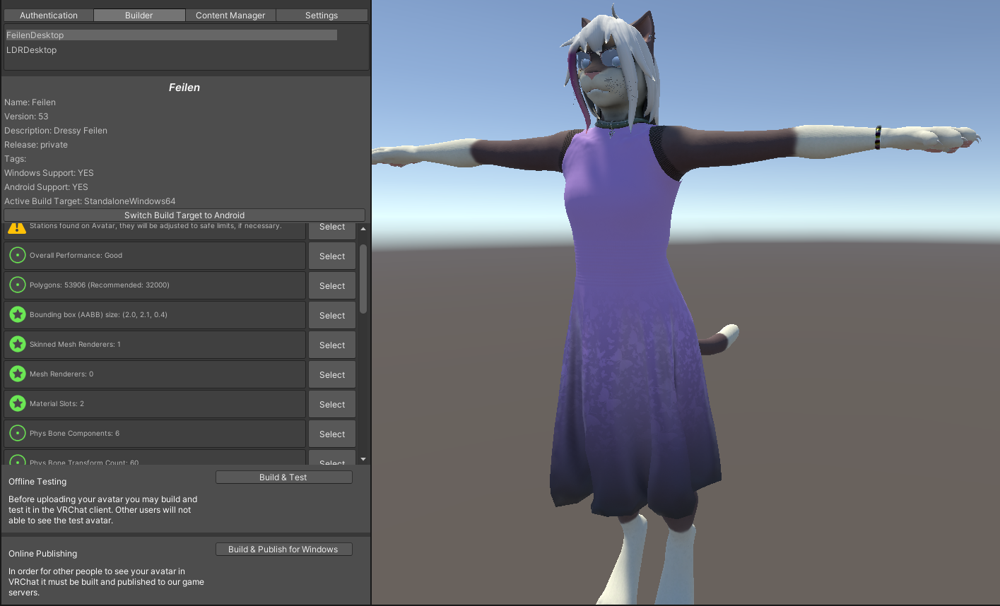

10. Upload through the VRChat control panel!

### Common issues:

- When baking, my model looks like the shading is broken.
	- Your islands are probably self-overlapping somehow. Try setting 'Overlap Correction' to 'Unmirror' or at worst 'Reproject'
	- Bake currently works best with smooth normals. In 'Object Data Properties', under 'Normals', make sure 'Auto Smooth' is unchecked, and right-click your objects and set them to 'Shade Smooth'.
- My model ends up with a lot of gray areas or wrong colors.
	- It's best to run 'Remove Doubles' before baking. For PMD/PMX models, use PMD import with 'Remove Doubles' checked for best results.
	- Reproject seems to work a lot better on 2.91 vs 2.83, try running it there for best results.
- The islands end up super tiny or some object is way too prioritized after baking.
	- Apply scale for your objects.
- One or more objects end up all one color/wrong after baking.
	- Your object may not have a UV map. Try creating one, or using 'Reproject' to have one generated automatically.
- My normal map ends up completely wrong/sharp/facing the wrong direction.
	- This can happen if your model has un-applied rotation. Select all and Ctrl+A -> "Apply all transforms" before baking.
- Baking is too slow!
	- Try enabling GPU baking. Make sure you have a backend (such as CUDA) selected in your Blender preferences!

### Detailed options:

#### General options

- **Resolution**: The width and height of the resulting textures.
	- Reccomended: see below
- **Decimate**: Whether to reduce the triangle count. Reccomended if you don't already have an optimized tri count.
	- Tris: The number of tris to reduce to. Lower is better, experiment with even lower than the set limits if you can.
		- On Desktop, this should either be 32000 (Excellent) or 70000 (Good).
		- On Quest, this should either be 7500 (Excellent), 10000 (Good), or 15000 (Medium).
			- While you can still upload at up to 20000 on Quest, people will be unable to see your avatar by default.
- **Generate UVMap**: Produces a new, non-overlapping UVMap. Neccesary for Normal maps to be produced correctly. Only disable if your UVMap doesn't overlap.
	- **Prioritize Eyes**: Scales the islands for Eyes up by a given factor, letting them be extra detailed.
	- **Overlap correction**: The method used to ensure islands don't self-intersect. Use 'unmirror' if your islands self-intersect only across the middle of the X axis, 'Reproject' if you have any other unusual situation. 'None' is fine if none of your islands are self-intersecting. 'Manual' can be used if you have specific needs, this will use any UVMap named 'Target' when baking.
- **Apply current shapekey mix**: This will update your basis to match the current state of your shapekeys. This is useful if you have 'body shape' shapekeys or similar, as having them constantly-active is hugely detrimental to performance.
- **Cleanup shapekeys** - This will remove common extra shapekeys generated by Blender. This includes 'Reverted' and '\_old' shapekeys. Keys ending in '\_bake' will always be applied and removed.
- **Merge twistbones** - Merges twistbones to their origin bones on export, if doing so won't affect the alphabetical hierarchy. Quest doesn't support constraints, so this makes things a little more performant there.

#### More info on PBR passes

- **Diffuse (Color)**: The un-lit color of your model. Most models will use this.
	- Bake to vertex colors: If your model has relatively simple coloring, use this to completely avoid having any textures.
	- Alpha: What to pack to the Alpha channel. The Autodetect button will automatically pick the most efficient setup for this.

	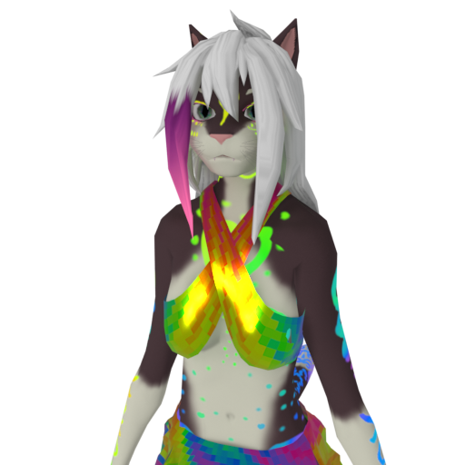
	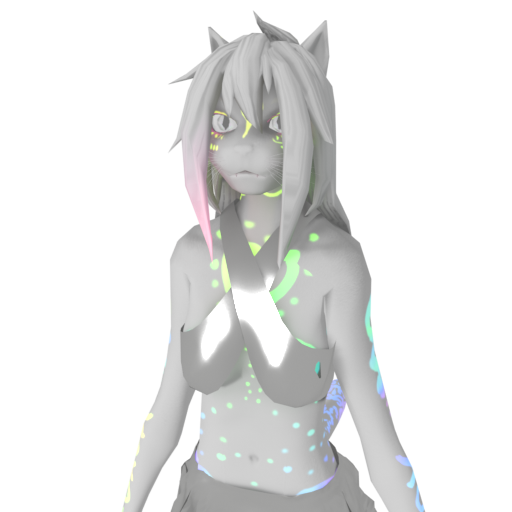
	
- **Normal (Bump)**: Allows your model to mimic more detailed geometry and surface detail, by shading as if certain areas are facing another direction. HIGHLY reccomended if you're decimating, as the Bake panel takes advantage of this to preserve a lot of detail.

	
	
	

	
- **Smoothness**: The smoothness detail of your avatar. Can create shiny or matte areas, great for increasing detail. Created by inverting the 'Roughness' that Blender uses.

	
	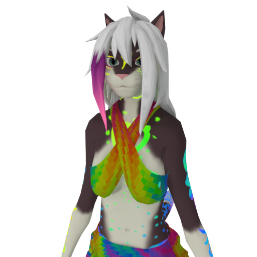
	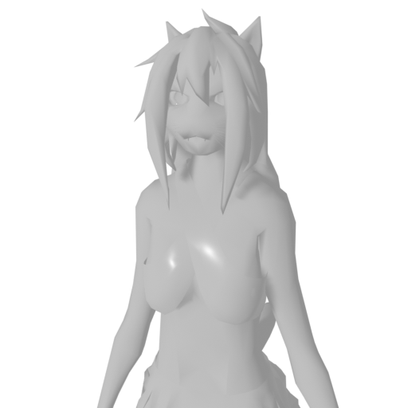
- **Ambient Occlusion**: Shadows caused by light reflecting between the object and itself. Adds a great amount of detail in corners, reccomended if it doesn't cause artifacts with your avatar. Can be messy if your avatar animates areas that are still when baking.
	- Set eyes to full brightness: Since eyes animate, you probably want this. Without it, the shadow of your eye sockets will be projected onto the surface of your eyes.

	
	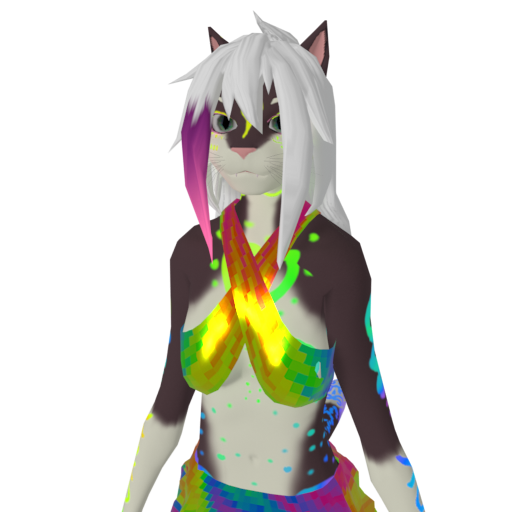
	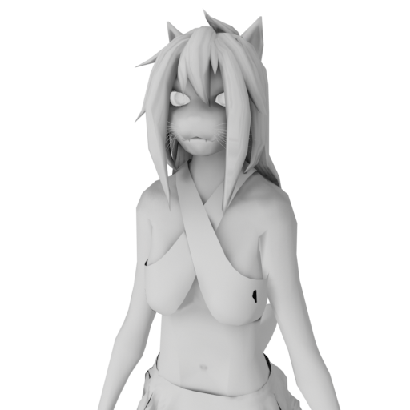
- **Transparency**: Self-explanatory. Not a native pass in Blender, so may be prone to issues.
- **Metallic**: How 'metal' a material is, generally '0' for non-metals and '1' for metals. Affects whether light reflected will be exactly the color of the material beneath or not.

	
	
	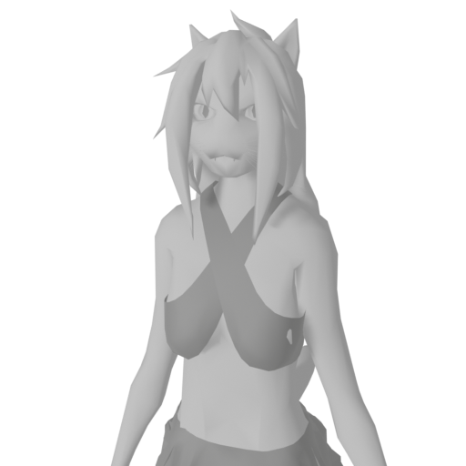
- **Emit**: The color of light emitted, used for anything that glows.
	- Bake Projected Light: Performs a full render instead of just copying the light value over. Causes lights to project onto neighboring surfaces, for a 'fake realtime' effect, fully Quest-compatible.

	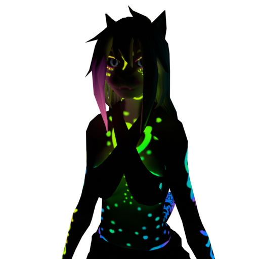
	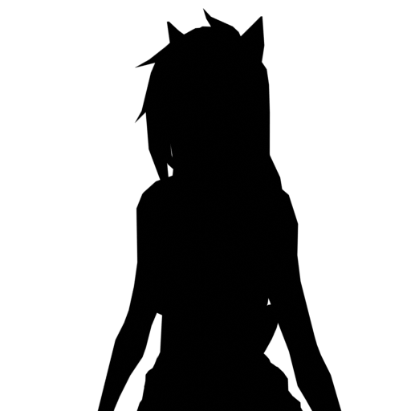
	

- **Displacement**: Produces maps capable of being rendered by the 'Height' map in Unity, adding a real stereo effect to surfaces for fine detail.
- **Detail**: Advanced users only. When a model is configured with a detail UV map named "Detail Map", this can be manually configured to allow for baking the detail mask, letting you have astonishing levels of detail with almost no VRAM overhead. Tutorial TBD!

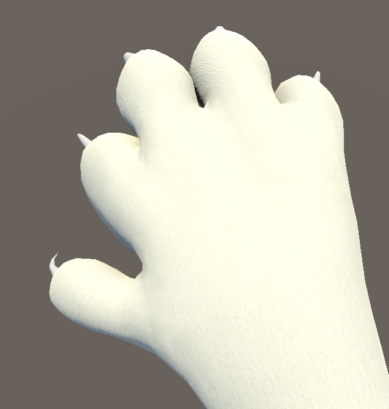

### Reccomended Texture Settings


 

**Quest:**
(Important: I reccomend you set your project's texture format to ASTC, as [reccomended in the docs](https://developer.oculus.com/documentation/unreal/unreal-ide-guide-android/). This doesn't allow crunch compression, but the VRAM size can often be halved or less.)
<table>
  <tr>
    <th>Pass name</th>
    <th>Mip Map Filtering</th>
    <th>Filter Mode</th>
    <th>Texture size</th>
    <th>Compression</th>
    <th>Resulting size</th>
    <th>Notes</th>
  </tr>
  <tr>
    <td>Diffuse/QuestDiffuse</td>
    <td>Kaiser</td>
    <td>Trilinear</td>
    <td>2048x2048</td>
    <td>Normal Quality</td>
    <td>2728kb</td>
    <td>Diffuse doesn't rely upon shading, so higher resolution can show off finer surface detail</td>
  </tr>
  <tr>
    <td>Normal</td>
    <td>Kaiser</td>
    <td>Trilinear</td>
    <td>1024x1024</td>
    <td>Normal Quality</td>
    <td>682kb</td>
    <td>Normal maps are important! The key feature of Bake is its high-to-low complexity normal bake, which makes the lowpoly mesh shade like it's the higher poly one</td>
  </tr>
  <tr>
    <td>Metallic(R)Smoothness(A)</td>
    <td>Kaiser</td>
    <td>Trilinear</td>
    <td>512x512</td>
    <td>Low Quality</td>
    <td>85kb</td>
    <td>If you're using this map to show fine surface details, use the same options as Normal. Otherwise, it's pretty safe to compress</td>
  </tr>
  <tr>
    <td>Emit</td>
    <td>Kaiser</td>
    <td>Trilinear</td>
    <td>1024x1024</td>
    <td>High Quality</td>
    <td>1264kb</td>
    <td>Emission is completely dependent on the encoded texture, and really easily shows compression artifacts. Higher quality is worth it.</td>
  </tr>
  <tr>
    <td></td>
    <td></td>
    <td></td>
    <td></td>
    <td>Total, if using all:</td>
    <td>4759kb</td>
    <td>(compressed, usually less than 1-2MB)</td>
  </tr>
</table>

**Desktop:**

* Same as above, but typically safe to go twice the texture resolution for each. (though 2048x2048 is usually fine for Diffuse)
* Main difference is that you will want to set Anisotropic Filtering to 8x or 16x, for more texture clarity at angles.

### How can I see what it'll look like on the Quest?

Almost all Quest worlds use baked lighting settings and a gradient, single-color, or skybox environment lighting. Disable all directional or realtime lights in your avatar scene, and then in the Lighting panel (Window->Rendering->Lighting) see what your model looks like with Source set to Gradient, Single Color (set to white) and Skybox lighting.

### Note on Bump Map input vs real displacement

If you intend to bake ambient occlusion, it's highly reccomended that you use a height map with Displacement instead of bump map node (or normal map).

To do this, you will need to connect a 'displacement' node between your height map and material output, and ensure your mesh has a 'subdivision' or 'multires' modifier with a handful of subdivisions present. You also need to enable displacement on a material basis in the sidebar: Material Properties -> Settings -> Surface -> set 'Displacement' to 'Displacement And Bump Map'


### Executing from the command line (Batch)

Bake can be easily called from the command line, if your model is already reasonably sanely setup in a Blend file.

```
> blender Feilen.blend -b --python-expr "import bpy
bpy.ops.tuxedo.preset_quest()
bpy.ops.tuxedo.bake()
exit()"
```

### Additional examples
 

_'Dawn' model by [@zombies_in_soup](https://twitter.com/zombies_in_soup)_
</details>

<details>
<summary>Generate twist bones automatically for more realistic avatar movement</summary>
	
[See '5-minute twistbones' on the wiki](https://github.com/feilen/tuxedo-blender-plugin/wiki/5-Minute-Twistbones)
	
</details>

<details>
<summary>Generate facial tracking shapekeys instantly from visemes!</summary>
	
### Generate shapekeys on the fly using just the AA, OH and CH visemes (together with the blink/smile/frown keys)!

</details>

### Installation:

Installation is pretty standard. Grab the latest .zip off the [releases](https://github.com/feilen/tuxedo-blender-plugin/releases) page and install using Blender's addon settings.

### Credits:

This plugin was orignially by Feilen with contribrutions by 989onan full credit goes to the original team.
